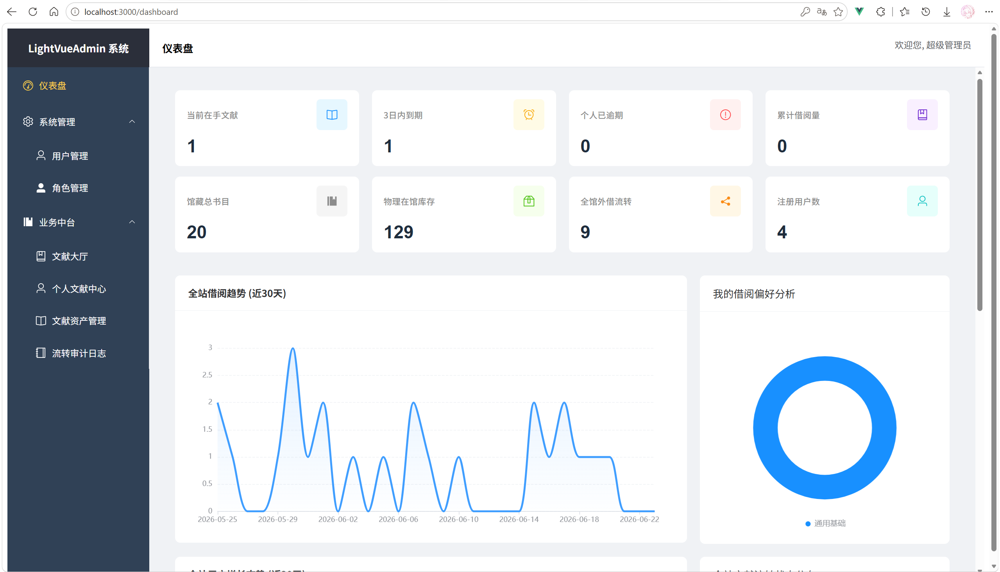

# LightVueAdmin

基于 RBAC 的 Vue 3 + NET 8 管理系统，用于文献资产和借阅流转管理。

[](https://vuejs.org/)
[](https://vitejs.dev/)
[](https://element-plus.org/)

## 项目简介

LightVueAdmin 是一个面向文献资产管理的后台系统。前端负责权限初始化、动态路由和按钮级权限控制；后端提供 JWT 认证和 REST API

核心功能：后端控制菜单 → 前端动态注册路由 → 按钮/接口双端校验 + 文献流转闭环 + 权限驱动 Dashboard

**测试账号**：`admin` / `password123`

## 技术栈

| 类别 | 技术 |
|------|------|
| 框架 | Vue 3 · Composition API |
| 构建工具 | Vite 8 |
| UI 库 | Element Plus |
| 路由 | Vue Router 5（History 模式） |
| 状态管理 | Pinia |
| 图表 | ECharts 6 |
| HTTP 客户端 | Axios（全局 Loading、Token 注入、统一错误处理） |
| 后端 | .NET 8 Web API + JWT |

## 功能模块

### 权限系统（RBAC）

- 三级模型：目录 → 菜单 → 按钮，统一使用 `PermCode` 标识
- 后端返回菜单树和权限，前端通过 `import.meta.glob` 映射组件，使用 `addRoute` 注入路由
- `v-has-perm` 指令控制按钮显示，`[HasPermission]` 特性验证后端 API 权限
- 根据用户角色控制不同模块的访问权限

### 系统管理

- **用户管理**：CRUD、分页查询、角色分配
- **角色管理**：CRUD、使用 `el-tree` 进行可视化权限分配

### 文献资产管理

- **资产管理**：管理员 CRUD、ISBN 唯一性校验、逻辑删除
- **文献目录**：用户浏览和批量借阅
- **个人借阅中心**：按转移状态筛选、自助归还
- **审计中心**：系统日志、批量指派、管理员操作

### Dashboard

- 单一聚合接口，按权限代码过滤 Widget
- 管理员：系统指标、借阅趋势、用户增长、信息流
- 普通用户：个人借阅指标、偏好分析、最近借阅快照

## 系统架构

```
登录（JWT）
    ↓
路由守卫：/api/auth/info（获取权限）
         /api/auth/menus（获取菜单树）
    ↓
PermissionStore → 动态路由注入
    ↓
Layout + Sidebar（后端菜单树）
    ↓
┌──────────────┬──────────────────────┐
│  Dashboard   │  业务模块            │
│  权限过滤    │  v-has-perm 按钮     │
│  UI          │  基于角色的访问      │
└──────────────┴──────────────────────┘
    ↓
api/* → Axios → 后端 REST API
```

**前端分层**：`router` → `store/permission` → `directives` → `api` → `views`

## 主要特性

- **后端驱动动态路由**：业务页面路由不硬编码，刷新后从后端重建
- **统一权限模型**：菜单（路由）、按钮（指令）和 API（后端）使用同一套 `PermCode` 标识
- **基于角色的模块访问**：区分用户自助功能和管理员功能的配置
- **文献资产生命周期管理**：完整的流程从入库 → 借阅 → 逾期 → 归还 → 审计
- **权限感知的 Dashboard**：同一页面根据用户角色和权限显示不同的指标


| 特性                 | 描述                     |
| ------------------ | ---------------------- |
| **后端驱动动态路由**       | 路由刷新后动态重建              |
| **统一权限模型**         | 菜单、按钮、接口共用 PermCode    |
| **模块访问分流**         | 区分全员自助与管理员可配置          |
| **文献流转闭环**         | 入库 → 借阅 → 逾期 → 归还 → 审计 |
| **权限驱动 Dashboard** | 单页面不同角色显示不同指标          |


## 快速启动

### 环境要求

- Node.js 18+
- .NET 8 SDK
- SQL Server（数据库连接字符串在后端配置）

### 后端启动

```bash
cd backend/MyAdmin.WebApi
cp appsettings.json.example appsettings.json   # 配置数据库连接
#可参照backend/MyAdmin.WebApi/appsettings.json.example
dotnet run
# 默认地址：http://localhost:5014
```

### 前端启动

```bash
cd frontend/LightVueAdmin
npm install
npm run dev
# 默认地址：http://localhost:3000，/api 代理到 5014
```

### 验证

1. 使用 `admin / password123` 登录 → 查看完整菜单和所有 Dashboard Widget
2. 创建普通用户并分配 `user` 角色 → 仅看到文献目录、个人中心和个人 Dashboard 指标

---

## 项目截图

### 首页-Dashboard

展示系统运营数据、借阅趋势及个人借阅统计信息，不同角色可查看不同数据内容。



更多界面截图（RBAC 权限配置、动态菜单、文献流转审计等）见 (docs/screenshots/)


## 项目演进

```
Vue3 脚手架
  → JWT 认证
  → RBAC 三级权限
  → 后端动态菜单 + 前端动态路由
  → v-has-perm 按钮权限
  → 用户/角色管理
  → 文献资产流转业务
  → 基于角色的模块分流
  → 权限感知的 Dashboard 聚合
```

**第 1 阶段**：权限基础 — 用户/角色/菜单/动态路由  
**第 2 阶段**：业务扩展 — 文献资产 + 借阅流转 + 审计  
**第 3 阶段**：Dashboard 单接口聚合 + 权限过滤 Widget

## 文档

| 文档 | 说明 |
|------|------|
| [ProjectInfo.md](./docs/ProjectInfo.md) | 项目详细介绍 |
| [FrontendGuide.md](./docs/FrontendGuide.md) | 前端开发指南 |
| [API.md](./docs/API.md) | 后端 API 文档 |
| [BackendGuide.md](./docs/BackendGuide.md) | 后端架构说明 |

## License

Private · 仅用于作品集展示
