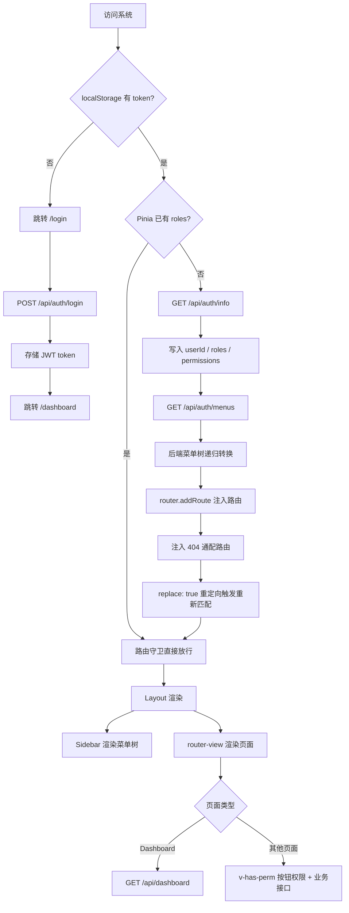
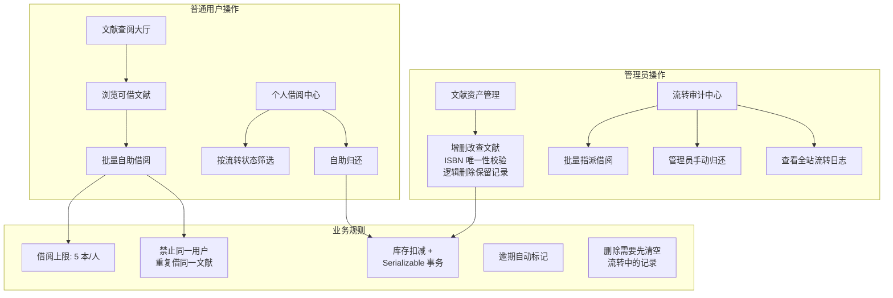
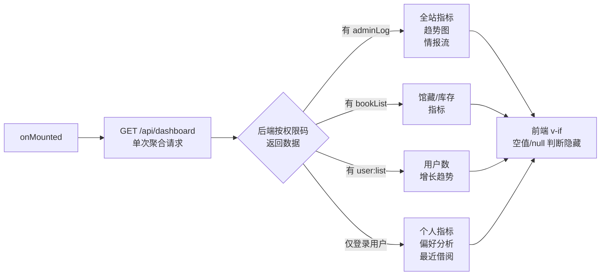
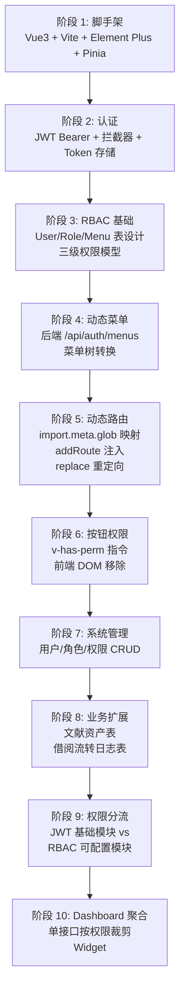

# LightVueAdmin 项目详解

本文档提供项目的技术架构、业务流程和系统设计的详细说明。

---

## 项目定位

**LightVueAdmin** 是一个后台管理系统，用于图书馆文献资产和借阅流转的管理。

### 系统分类

| 类型 | 匹配度 | 说明 |
|------|--------|------|
| 后台管理系统 | ✅ 主要定位 | Vue3 SPA + Layout 框架 + 侧边栏 + RBAC + 动态路由，典型的管理系统架构 |
| 企业应用 | ✅ 辅助定位 | 实现组织内的文献入库、借阅流转、审计追溯等业务闭环 |

### 关键特征

- **单租户架构**：单一数据库、单一角色体系，面向单个组织
- **权限驱动**：菜单、路由和按钮的访问权限统一通过后端配置
- **权限导向的 UI**：同一页面在不同权限下显示不同内容

---

## 核心业务流程

### 系统级主链路

从用户登录到页面访问的完整流程：



### 权限体系架构

权限从数据库到前端的流转链路：

```mermaid
flowchart LR
    subgraph 数据模型
        U[SysUser] --> UR[SysUserRole]
        UR --> R[SysRole]
        R --> RM[SysRoleMenu]
        RM --> M[SysMenu]
    end

    subgraph 菜单分类
        M --> D[类型 0: 目录]
        M --> P[类型 1: 菜单 → 路由]
        M --> B[类型 2: 按钮 → 权限码]
    end

    subgraph 前端消费
        P --> RT[import.meta.glob 组件映射]
        B --> INFO[/api/auth/info 权限列表]
        INFO --> DIR[v-has-perm 指令]
        INFO --> STORE[PermissionStore.hasPermission]
    end

    subgraph 后端消费
        B --> API[HasPermission 特性]
    end
```

### 文献流转业务流程

从管理员和普通用户两个视角展示的业务流程：



### Dashboard 数据流

Dashboard 聚合接口根据用户权限返回不同数据：



---

## 系统演进

项目的开发阶段和关键决策点：



### 主要里程碑

| 时间 | 事件 | 意义 |
|------|------|------|
| 2026-06-01 | 数据库初始化迁移 | RBAC 基础设施一次性设计完成 |
| 2026-06-04 | 文献资产表创建 | 从纯权限系统升级为有业务闭环的管理系统 |
| 2026-06 | JWT 分流设计 | 区分全员功能与管理员功能，简化权限配置 |
| 2026-06 | Dashboard 聚合 | 单一页面在不同权限下展示不同内容 |

---

## 技术设计

### 1. 后端驱动的动态路由

**设计考虑**：

- 静态路由仅包含：`/login`、`/`（包含 Dashboard）、`/404`
- 所有业务页面路由完全由后端 `/api/auth/menus` 返回
- 前端使用 `import.meta.glob` 进行组件映射，支持懒加载
- 路由守卫完成：获取权限 → 转换菜单为路由 → `addRoute` 注入 → `replace` 重定向

**实现细节**：
```
fetchUserInfo() → 获取权限码和菜单树
    ↓
generateRoutes() → 递归菜单树，映射组件
    ↓
router.addRoute() → 逐条注入
    ↓
replace: true → 重新匹配路由（解决刷新白屏）
```

**优势**：
- 权限配置完全后端驱动，前端无需编码修改菜单
- 支持动态菜单调整，刷新后自动更新路由

**约束**：
- Dashboard 路由仍写在前端静态路由中，未纳入后端菜单树

---

### 2. RBAC 三级权限模型

**设计结构**：

所有权限统一存储在 `SysMenu` 表中，通过 `MenuType` 区分：

| MenuType | 用途 | 示例 | 消费方 |
|----------|------|------|--------|
| 0 | 菜单目录 | "系统管理" | 侧边栏分组 |
| 1 | 菜单项（路由） | "用户管理" | 动态路由 + 侧边栏导航 |
| 2 | 按钮（权限码） | "user:create" | 前端指令 + 后端特性 |

**权限检查流程**：

```
用户操作按钮
    ↓
v-has-perm 指令 查询 PermissionStore.permissions
    ↓
前端放行 → 发起请求
    ↓
后端 [HasPermission("code")] 特性 再次校验
    ↓
业务执行或返回 403
```

**设计特点**：
- 权限码统一标识：`module:resource:action`（如 `user:create`）
- 前端隐藏和后端鉴权双层防护
- 超级管理员支持 `*.*.*` 通配符

---

### 3. JWT 基础模块与可配置模块分流

**问题场景**：

某些功能（如"文献查阅大厅""个人借阅中心"）应该对所有已登录用户可见，不需要逐一配置。
同时，管理员功能需要细粒度的角色控制。

**解决方案**：

**基础模块**（JWT 级别）：
- "文献查阅大厅"和"个人借阅中心"标记为 JWT 基础自助模块
- 后端动态菜单生成时，自动合并到所有角色的菜单树中
- 在角色权限配置页面（el-tree）中排除这些模块，避免重复配置

**可配置模块**（RBAC）：
- "文献资产管理""流转审计中心"等管理功能走标准 RBAC
- 需要在角色配置中逐一勾选

**实现方式**：
```
后端 JwtBaselineMenuHelper 类
    → 生成基础菜单列表
    → 动态菜单生成时 Merge 基础模块
    → 权限配置树生成时 Exclude 基础模块
```

**优势**：
- 避免权限配置的重复和遗漏
- 清晰区分全员功能与管理员功能
- 减少角色权限管理的复杂性

---

### 4. 文献流转的数据隔离与业务规则

**双通道借阅**：

| 通道 | 调用者 | 接口 | 数据隔离 |
|------|--------|------|----------|
| 指派 | 管理员 | `POST /api/borrow` | 接口参数 userId |
| 自助 | 普通用户 | `POST /api/borrow/self` | JWT 中自动取 userId |

**双通道归还**：

| 通道 | 调用者 | 接口 | 校验 |
|------|--------|------|------|
| 管理员 | 管理员 | `DELETE /api/borrow/{logId}` | 任意 logId |
| 自助 | 用户 | `DELETE /api/borrow/self/{logId}` | logId 所有权 + userId 匹配 |

**审计日志权限隔离**：

```
GET /api/borrow-log/list
    ↓
后端检查权限码
    ↓
有 adminLog → 返回全站日志
无 adminLog → 返回仅当前用户日志
```

**业务规则**：
- 单人借阅上限：5 本
- 防重复借：同一用户不能两次借同一文献
- 库存扣减：Serializable 事务防超卖
- 逾期标记：状态为"流转中"且超期自动标记
- 逻辑删除：删除文献前需清空该文献的流转中记录

---

### 5. 权限感知的 Dashboard

**设计原则**：

- 单一 Dashboard 页面，不因权限写两套 UI
- 后端单个聚合接口 `/api/dashboard`，按权限码返回不同字段
- 前端 `v-if` 判空值来控制渲染

**数据结构**：

```javascript
// 管理员返回的完整数据
{
  summary: {
    totalBooks: 1000,        // 有 bookList 权限
    totalUsers: 50,           // 有 user:list 权限
    totalBorrows: 200         // 有 adminLog 权限
  },
  trends: [ ... ],           // 有 adminLog 权限
  personalMetrics: { ... }   // 所有用户都有
}

// 普通用户返回的数据（管理员字段为 null）
{
  summary: {
    totalBooks: null,
    totalUsers: null,
    totalBorrows: null
  },
  trends: null,
  personalMetrics: { ... }
}
```

**前端渲染**：

```vue
<StatisticCards 
  v-if="summary.totalBooks !== null"
  :data="summary"
/>

<TrendChart 
  v-if="trends !== null && trends.length > 0"
  :data="trends"
/>
```

**优势**：
- 同一组件，不同权限显示不同内容
- 易于扩展新的权限维度
- 减少前端代码重复

---

### 6. v-has-perm 按钮权限指令

**实现机制**：

```javascript
// 指令定义
app.directive('has-perm', {
  mounted(el, binding) {
    const permCode = binding.value
    if (!PermissionStore.hasPermission(permCode)) {
      el.parentNode.removeChild(el)  // DOM 级移除
    }
  }
})

// 使用
<button v-has-perm="'user:create'">新增用户</button>
<button v-has-perm="['user:edit', 'user:delete']">编辑/删除</button>
```

**特点**：
- `removeChild` 比 `v-if` 更彻底，完全移除 DOM
- 支持权限码字符串或数组（数组为 OR 逻辑）

---

### 7. Axios 请求层设计

**全局 Loading 机制**：

- 200ms 延迟显示 Loading（避免快速请求闪屏）
- 300ms 最小展示时长（避免加载条过快闪烁）
- 并发请求计数器

**错误处理分流**：

| 状态码 | 处理 |
|--------|------|
| 401 | 清空 token，跳转登录 |
| 403 | 权限不足错误提示 |
| 502/504 | 网络问题提示 |
| 其他 5xx | 服务器错误提示 |

**特殊处理**：

- 路由切换时 `forceCloseLoading` 清理残留遮罩
- 请求头自动注入 `Authorization: Bearer <token>`

---

## 前端架构

### 分层设计

```
┌─────────────────────────────────────────────┐
│  Views（业务页面）                           │
│  dashboard / knowledge / user / role / login│
└─────────────────┬───────────────────────────┘
                  │
┌─────────────────▼───────────────────────────┐
│  Layout + Sidebar                           │
│  菜单树来自 PermissionStore                   │
└─────────────────┬───────────────────────────┘
                  │
┌─────────────────▼───────────────────────────┐
│  Router Guard + PermissionStore             │
│  权限初始化 → 路由转换 → 动态注入             │
└─────────────────┬───────────────────────────┘
                  │
┌─────────────────▼───────────────────────────┐
│  Directives + API 模块                      │
│  v-has-perm 权限控制                         │
│  api/* 接口调用                              │
└─────────────────┬───────────────────────────┘
                  │
        Backend REST API
```

### 目录结构

| 路径 | 职责 |
|------|------|
| `router/index.js` | 静态路由定义、路由守卫、权限初始化 |
| `store/permission.js` | 用户信息、权限码、菜单树、路由转换逻辑 |
| `directives/hasPerm.js` | v-has-perm 按钮权限指令 |
| `api/*.js` | 按业务模块封装 REST 调用 |
| `views/dashboard/*` | Dashboard 聚合页面及子组件 |
| `views/knowledge/*` | 文献业务模块（资产、大厅、个人、审计） |
| `views/user/*` | 用户管理页面 |
| `views/role/*` | 角色管理及权限配置页面 |
| `layout/` | 主框架布局（侧边栏、顶栏、内容区） |
| `utils/request.js` | Axios 实例和全局拦截器 |

---

## 系统设计说明

### 设计约束与考虑

| 项 | 说明 | 原因 |
|----|------|------|
| Dashboard 静态挂载 | Dashboard 路由写在前端，未纳入后端菜单树 | 控制变量，Dashboard 权限隔离通过数据完成 |
| Token 存储方式 | 存储在 localStorage 中 | 简化实现；未使用 Refresh Token / HttpOnly Cookie |
| 权限指令时机 | v-has-perm 仅在 mounted 执行 | 权限异步变化后不自动重新评估 |
| 路由嵌套 | 支持多层嵌套菜单和路由 | Layout 复用策略相对简单，深层嵌套可能需要优化 |
| 单点登录 | 未实现 | 系统设计为单一管理系统，暂无跨系统认证需求 |

### 已知限制

- **Dashboard 入口**：侧边栏中 Dashboard 入口仍为硬编码（不在后端菜单树中）
- **菜单显示**：某些情况下菜单项模板选择有误（menu.template vs menu.title）
- **权限刷新**：运行时权限变化需要手动刷新页面才能生效
- **Token 安全**：localStorage 存储方式在 XSS 攻击下有风险

---

## 总结

LightVueAdmin 是一个重点解决**权限工程**和**权限导向 UI** 的管理系统，核心设计包括：

1. **完整的权限链路**：后端菜单驱动 → 前端动态路由 → 按钮级权限控制 → 接口级校验
2. **权限模型的业务优化**：区分全员功能与管理员功能，简化权限配置
3. **业务闭环的数据隔离**：文献流转、借阅管理、审计日志的权限感知设计
4. **权限感知的 UI 设计**：同一页面根据权限显示不同内容，而非写死多套页面

系统适合作为理解 Vue3 + RBAC + 后端驱动架构的参考实现。
